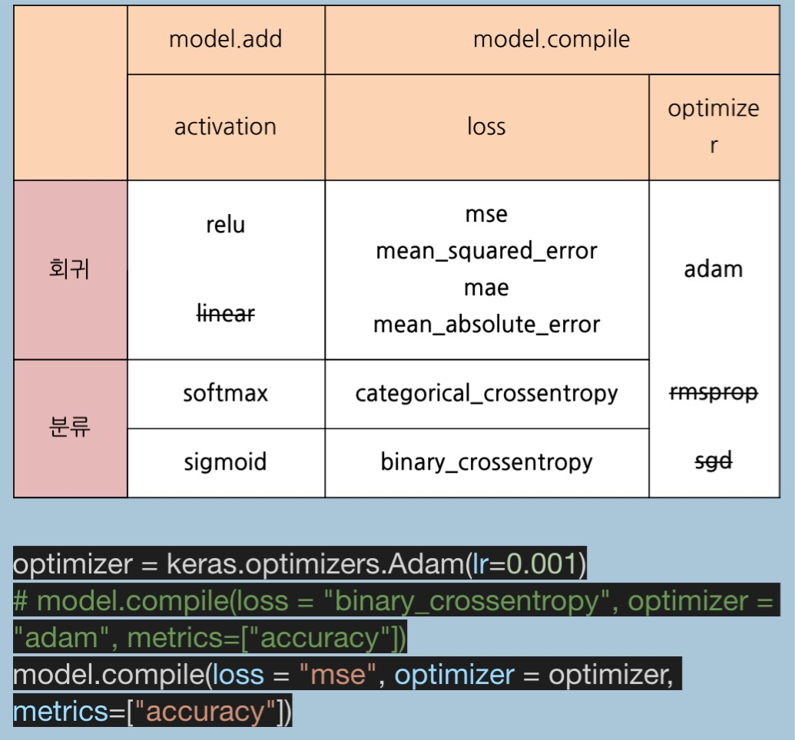

# 케라스 스터디 1일차 
- 참고도서 정리 
- y = wx + b  이해 
- 딥런닝의 의미 - 히든 레이어를 가진 뉴럴 네트웍 \
  히든 레이어의 파라미터 갯수 및 인풋 아웃풋 shape 이해 
- keras basic patten - add, compile, fit, evaluate/predict
- optimizer, loss, matrics 이해 
- R2, RMSE 이해 
- 경진대회 도전:  https://dacon.io/cpt6

과제 :  
1) 다중입력-1\
    1~10까지, 101~110 까지 입력하여 1~10, 101~110 까지 출력 \
    rmse, r2
2) 다중입력-2
    concatenate 사용할것 \
    rmse, r2
3) activation, loss, optimaizer 함수 정리 - 추가정리 필요 

