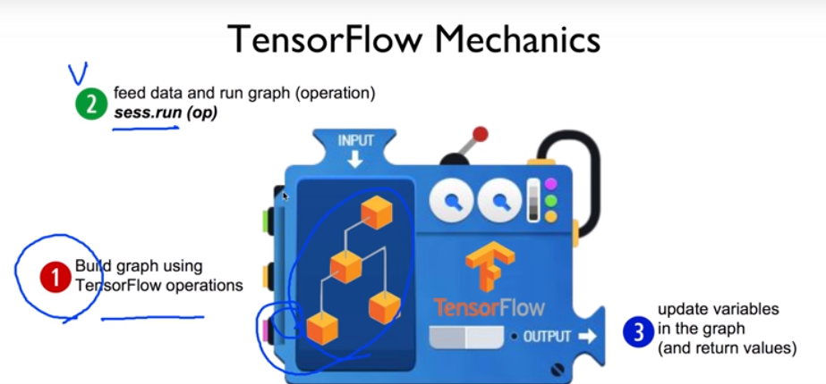
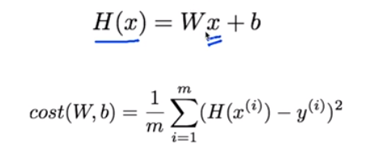
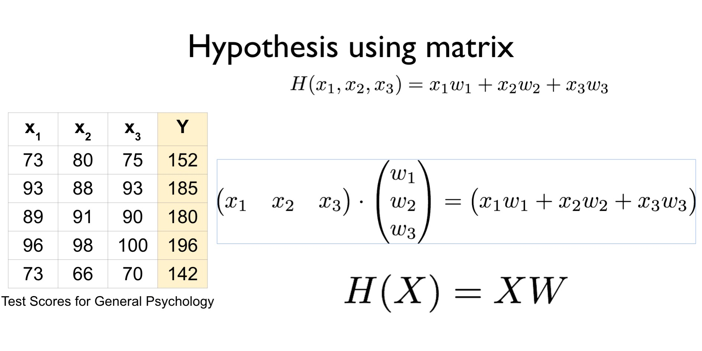

**Today I Learned**

텐서플로..

    텐서는 data arrary...데이터의 덩어리...
    여러 텐서의 연산을 거치면서 결과물을 찾아낸다..
    텐서의 플로우를 정의한다..=> tensorflow

* 참고
https://github.com/hunkim/DeepLearningZeroToAll - 소스 
(모두를 위한 머신러닝/딥러니 강의 https://hunkim.github.io/ml/)

TF 기본구조

    1. make tensor - tf.placeholder
    2. make flow(graph) - 연산을 이용한 텐서의 흐름 정의
    3. create session -   sesssion.run
    4. result review - print

      
    rank.. -차원...3차원 4차원
    shape..-차원에 몇개의 열을 가지고 있나
    type.. float32, int32를 많이 사용함.. 

cmd에서 설치 완료..VScode에서는 작동 안됨.
https://www.python.org/downloads/release/python-366/ 에서 3.6.6 설치 필요

    -python3.6 -m pip install tensorflow
    ㅡmac os : sudo python3.6 -m pip install --upgrade tensorflow, sudo python3.6 -m pip install --upgrade matplotlib

vscode에서 컴파일러 변경하고 디버그 사용해서 실행하면 됨
설치시마다 종료후 재시작 해야 import 인식함 

Linear regression - 모델 = 수학공식

미분은 https://www.derivative-calculator.net/ 에 수식을 넣으면 계산해 줌

---
다중변수일 경우 
- 변수를 여러개 처리 - 무식하게 처리 가능..

 
- 메트릭스로 하나의 수식으로 해결 가능 

1. 행 => 인스턴스 
2. 열 => variable/feature의 갯수....