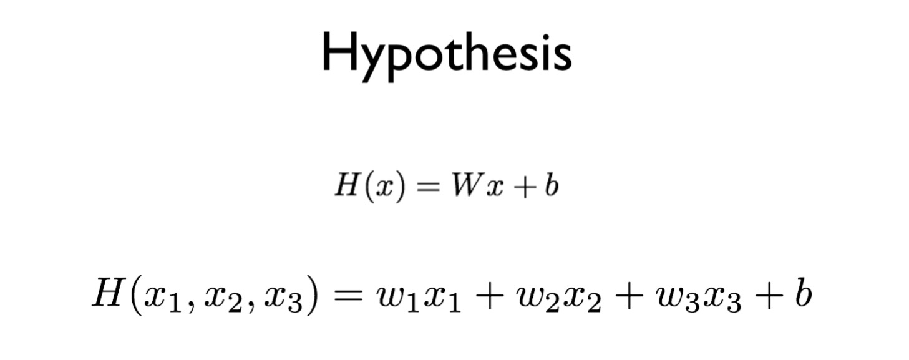
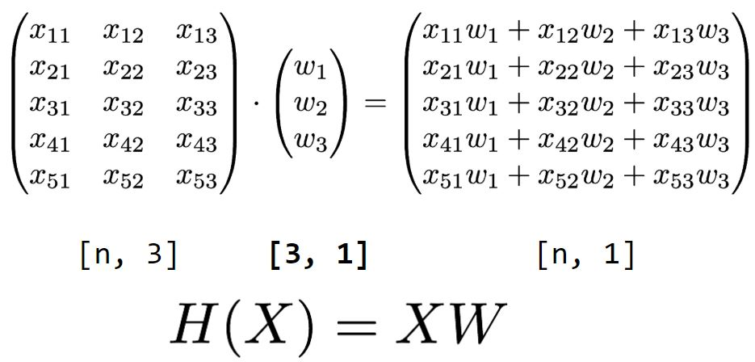
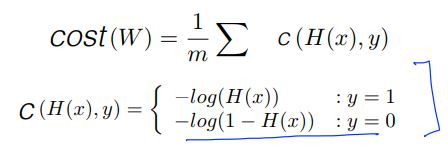
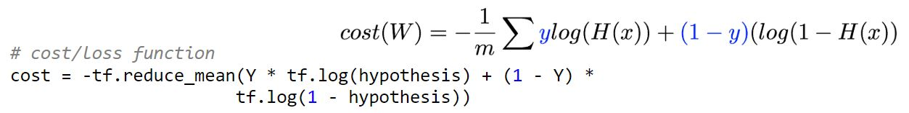
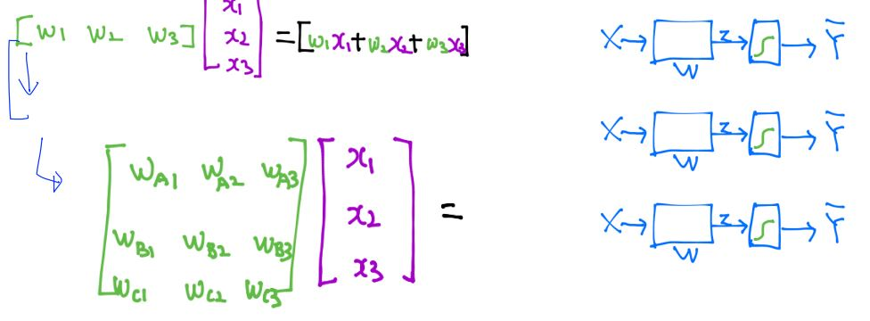
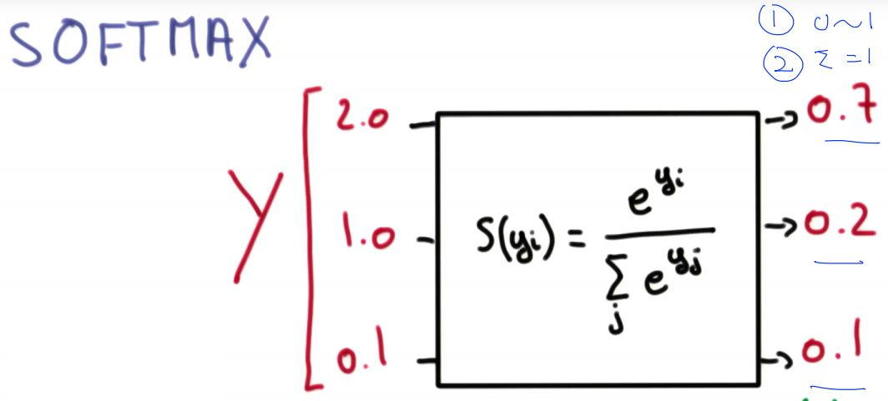
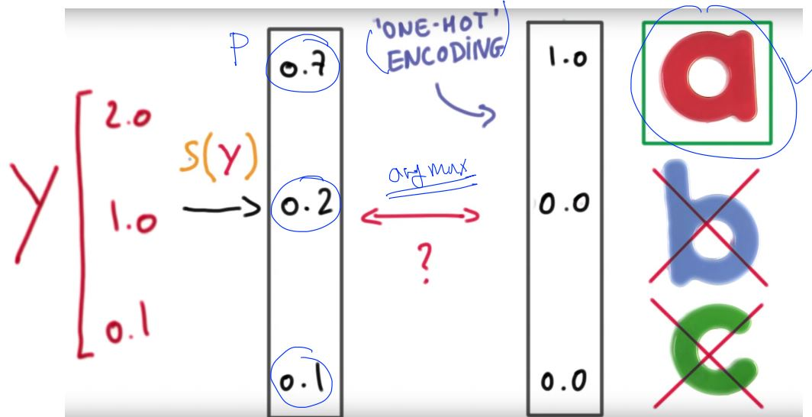

**Today I Learned**

텐서플로..

    텐서는 data arrary...데이터의 덩어리...
    여러 텐서의 연산을 거치면서 결과물을 찾아낸다..
    텐서의 플로우를 정의한다..=> tensorflow

* 참고
https://github.com/hunkim/DeepLearningZeroToAll - 소스 
(모두를 위한 머신러닝/딥러니 강의 https://hunkim.github.io/ml/)

TF 기본구조 

    1. make tensor - tf.placeholder
    2. make flow(graph) - 연산을 이용한 텐서의 흐름 정의
        계산식 정의(hypothesis), 최소화 함수(cost)
    3. create session -   sesssion.run
        학습, 학습을 토대로 예측

기본용어

    rank.. -차원...3차원 4차원
    shape..-차원에 몇개의 열을 가지고 있나
    type.. float32, int32를 많이 사용함.. 

설치 

    cmd에서 설치 완료..VScode에서는 작동 안됨.
    https://www.python.org/downloads/release/python-366/ 에서 3.6.6 설치 필요

    - python3.6 -m pip install tensorflow
    - mac os : sudo python3.6 -m pip install --upgrade tensorflow, sudo python3.6 -m pip install --upgrade matplotlib

    vscode에서 컴파일러 변경하고 디버그 사용해서 실행하면 됨
    설치시마다 종료후 재시작 해야 import 인식함 - 개선 필요

# 1. Linear regression - Feature 1개.

    h(x) = wx + b : 2차원상의 임의의 선
    cost = h(x) - y   : h(x) 예측,y 실제 값(Label)
    예측과 실제의 차이가(cost) 최소로 나오게  w, b를 업데이트.

    gradient descent algorithm을 사용해서
    cost(loss: 실제와 가설의 차이)의 가중치 W는 학습할수록 최소값으로 업데이트됨(b는 상수이므로 일단 무시)

    TF 옵티마이져 로직에서 자동 처리

    미분은 https://www.derivative-calculator.net/ 에 수식을 넣으면 미분식을 변환해 줌

# 2. multi-variable linear regression - Feature 가 여러개

    무식하게 나열하면서 처리 가능..

 
    메트릭스로 하나의 수식으로 표현 가능 => 행렬의 곱
    hypothesis = tf.matmul(X, W) + b

    행 => 인스턴스 
    열 => variable/feature의 갯수....
    인스턴스가 많아도 weight는 하나의 열(Label)임..

    데이터, weight, 결과 3개의 shape를 이해해야 함
    1. 데이터(x), 결과(y)는 shape 정해져 있음 - 학습데이터
    2. weight의 shape 확인 필요
    - [n, 3] [?, ?] [n, 2] => weight [3,2]

# 3. logistic(sigmoid) classification - 결과의 범위를 지정

    평균치 보다 큰 데이터가 들어오는 경우 결과가 왜곡됨.

    예상 결과치에 sigmoid 함수를 적용(0과 1사이의 값으로 변환)
    hypothesis = tf.sigmoid(tf.matmul(X, W) + b)
    h가 변경되었으므로 W도 변경되어 져야 함.
    
.JPG) 

 

    실제 y와 예산 H(x)의 차이의 최소화.
    실제는 0과 1 둘중 하나이므로 두가지 케이스를 로그적용

 

    Y가 0,1 두가지 조건을 하나의 수식으로 표현

    tf code로 수식을 그대로 변환
    이후 미분, 학습은 tf 표준코드 사용
    
    hy 예측 공식을 먼저 만듬
    예측과 결과(Y)의 최소화 공식(cost)을 만듬
    공식(cost)를 반복 학습하여 최소의 W를 구함 - 미분
    예상이 0.5 이상이면 참 아니면 거짓

# 4. multinomial(softmax logistic) regression

결과가 1, 0이 아닌 여러가지 선택지를 가지는 경우
메트릭스 연산으로 각각의 확율이 계산됨

    

    각각을 행렬곱으로 계산 함.
    sigmoid를 시키면 0~1 사이의 값이됨
    softmax를 시키면 0~1 사이 이면서 합이 1이 됨
    hypothesis = tf.nn.softmax(tf.matmul(X,W)+b)

    one-hot ending (값이 가장 큰 항목을 1 나머지는 0 )
    

    

    one-hot encoding을 하면 하나의 값으로 귀결됨

  

    softmax_cross_entropy_with_logits 를 사용하면
    hypothsis와 logit으로 분리해서 사용

    tf api 참조 https://m.blog.naver.com/PostView.nhn?blogId=wideeyed&logNo=221164668953&proxyReferer=https%3A%2F%2Fwww.google.com%2F

# 5. ML 실용 팁

learning rate 적용
- 정답이 없음 보통 0.01 부터 위아래로 순차적으로 적용 해서 정확도 확인 함
- overfitting

평준화(standarzation) - data Preporcessing
- 데이터의 값이 너무 편차가 심할때 사용(0~1 사이값으로 조정)
- MinMaxScaler(xy) 주로 사용함

일반화(Regularzation)
- W의 값이 너무 크지 않도록 조정
- regularzation strength를 사용

온라인 러닝.
- 데이터 셋을 계속 가져와서 이전 학습 내용을 기억하고 새 데이터로 이전 학습에 더해서 학습

epoch/batch
- epoch : 모든 트레이닝 데이터를 한번 학습한 단위
- batch : 한번에 메모리에 올릴 트레이닝 데이터 셋의 단위
- iterations : 반복 횟수
- ex> 1000개의 데이터가 있고 한번에 500개씩 학습하면 2번의 반복으로 1번이 epoch 가 완료됨

# 6. Deep Learning..

shape, rank, Axis
shape를 유의해서..matmul을 사용

# XOR 해결 + CNN

Neural Net으로 해결 
Back propagation => 편미분 + chain Rule 적용
Convolutional Neural Networks(CNN)

NN의 출력 => Activate function
deep : 계층을 여러개 / wide : 계층 끼리 연결되는 출력을 넓게
sigmoid에서 ReLU(Rectified Linear Unit) 로 진화

intial weight => Xavier initialization

dropout => 일부 넷을 비활성화(학습시만)

ensemble(앙상블) => 여러개의 학습모델을 동시에 학습해서 하나로 통합

Stride 샘츨 추출 이동 단위??
zeropad board => 가장자리 인식을위한 가상 위치

Convolution layers(CONV, ReLU) 

Pooling layer (sampling) => 각영역 최대값만 추출

# RNN - Recurrent Neural Network

sequence data 처리를 위해 개발(CNN의 한계) \
연속된 데이터의 앞뒤 관계를 이해한다(time series)\
usually want to predict a vector at some time steps \
(Vanilla) Recurrent NN 이라고도 함 - 기본 RNN을  의미 \

대표적 RNN 
- LSTM(Long Short Term Memory) 
- GRU

